<p align="center">
	PEMROGRAMAN WEB
</p>
<p align="center">
	TUGAS PRATIKUM 6
</p>
<p align="center">
	Dosen Pengampu : Agung Nugroho, M.Kom
</p>
<p align="center"> 
	<b>Tugas untuk memenuhi syarat penilain pada Pert-7</b>
</p>

<p align="center">
	
</p>

<p align="center">
                 Nama  : Jose Fisto
</p>
<p align="center">
                 NIM   : 312010119
</p>
<p align="center">
                 Kelas : TI.20 A.1
</p>

<br/>
<br/>

<p align="center">
	<b>UNIVERSITAS PELITA BANGSA</b>
</p>
<p align="center">
	<b>FAKULTAS TEKNIK</b>
</p>
<p align="center">
	<b>TEKNIK INFORMATIKA</b>
</p>
<p align="center">
	<b>TA 2021 / 2022</b>
</p>

<br></br>

<hr>
</hr>


<br></br>

# Laporan Praktikum 6

# 1. Membuat Struktur Dasar Dokumen html

Dibawah adalah contoh dari struktur Dasar Html menggunakan Framework Bootstrap Untuk menggunakan Framework bootstrap agar terhubung dengan Dokumen Html memerlukan Link yang sudah disediakan bootstrap dengan link CDN atau melalui Online link Seperti contoh salinan code dibawah

code html dan link bootstrap

```html
<!doctype html>
<html lang="en">
  <head>
    <!-- Required meta tags -->
    <meta charset="utf-8">
    <meta name="viewport" content="width=device-width, initial-scale=1">
    
    <!-- Bootstrap CSS -->
    <link href="https://cdn.jsdelivr.net/npm/bootstrap@5.1.3/dist/css/bootstrap.min.css" rel="stylesheet" integrity="sha384-1BmE4kWBq78iYhFldvKuhfTAU6auU8tT94WrHftjDbrCEXSU1oBoqyl2QvZ6jIW3" crossorigin="anonymous">
    
    <title>Web Framework</title>
  </head>
  <body>
    <!-- Optional JavaScript; choose one of the two! -->

    <!-- Option 1: Bootstrap Bundle with Popper -->
    <script src="https://cdn.jsdelivr.net/npm/bootstrap@5.1.3/dist/js/bootstrap.bundle.min.js" integrity="sha384-ka7Sk0Gln4gmtz2MlQnikT1wXgYsOg+OMhuP+IlRH9sENBO0LRn5q+8nbTov4+1p" crossorigin="anonymous"></script>
    
    <!-- Option 2: Separate Popper and Bootstrap JS -->
    <!--
    <script src="https://cdn.jsdelivr.net/npm/@popperjs/core@2.10.2/dist/umd/popper.min.js" integrity="sha384-7+zCNj/IqJ95wo16oMtfsKbZ9ccEh31eOz1HGyDuCQ6wgnyJNSYdrPa03rtR1zdB" crossorigin="anonymous"></script>
    <script src="https://cdn.jsdelivr.net/npm/bootstrap@5.1.3/dist/js/bootstrap.min.js" integrity="sha384-QJHtvGhmr9XOIpI6YVutG+2QOK9T+ZnN4kzFN1RtK3zEFEIsxhlmWl5/YESvpZ13" crossorigin="anonymous"></script>
    -->
  </body>
</html>
```

 # 2. MEMBUAT CONTAINER

 ini adalah cara Membuat Container dengan class container container ini adalah container biasa di akan secara default hanya selebar url di atas layar atau tidak ukuran full width sementara untuk class container-fluid dia full width 100% itu perbedaan jenis container dibootstrap sudah terdesain otomatis hanya tinggal bagaiman kita membutuhkan nya,namun disini saya menggunakan container jenis biasa yang tidak full width.

code html

```html
<!-- Container -->
    <div class="container">

    </div>
```

# 3. Membuat card

Code html dan output
```html
<div class="container shadow-lg">
    <div class="card-body">
        <h1 class="text-muted py-3">Layout Sederhana</h1>
    </div>
</div>
```

Berikut hasil atau tampilan dari Header saya yang buat dan  juga menambahkan Box-Shadow-lg atau large dan juga padding atas bawah atau dalam bootstrap yaitu py dan juga beberapa class untuk membuat nya dan simpan code dalam body untuk hasil outputnya bisa disimak dibawah ini
output :

<p align="center">
	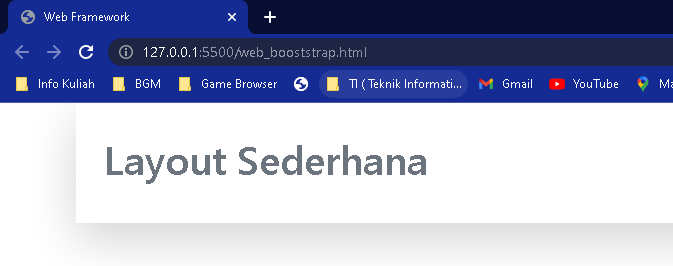
</p>

# 4 . Membuat navigasi 

Membuat Navigasi dengan class "navbar" bootstrap telah menyediakan semuanya hanya pada kita nya saja yang mendesain sesuai dengan  kebutuhan,seperti di atas memakai navigasi dengan class navbar dan beberapa class lainnya untuk mendukung navigasi nya seperti contoh nav class active di dalam element html di bootstrap dapat menggunakan banyak class dalam mendesain yang tersedia di bootstrap.

Script kode navigasi
```html
        <!--Navigasi-->
        <nav class="navbar" style="background-color: #1f5faa;">
            <ul class="nav nav-pills">
                <li class="nav-item">
                    <a class="nav-link active text-light" aria-current="page" href="#">Home</a>
                </li>
                <li class="nav-item">
                    <a class="nav-link text-light" href="#">Article</a>
                </li>
                <li class="nav-item">
                    <a class="nav-link text-light" href="#">About</a>
                </li>
                <li class="nav-item">
                    <a class="nav-link text-light" href="#">Contact</a>
                </li>
            </ul>
        </nav>
```
Output :

<p align="center">
	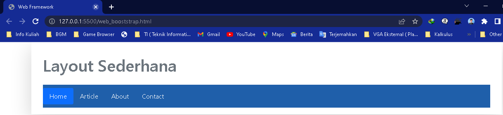
</p>

# 5 . Membuat card section description

Selanjutnya yaitu membuat card body dengan isi section description atau isi konten deskripsi saya menggunakan div dengan class card kemudian saya tambahkan inline css untuk sedikit mengatur sesuai layout nya dan juga menggunakan beberapa class di bootstrap nya seperti contoh gambar di atas.

Script kode card section
```html
<!--Card Section-->
<div class="card" style="width: 80,1rem; padding: 50px 20px; background-color: #e4e4e5; border-radius: 0;">
    <div class="card-body">
        <h1 class="card-title pb-4" style="font-weight: bold;">Hello World!</h1>
        <p class="card-text">Lorem ipsum dolor sit amet consectetur adipisicing elit. Voluptatem saepe
            necessitatibus aspernatur nisi autem delectus excepturi nostrum natus similique beatae
            reiciendis, quos placeat sapiente qui sint voluptatibus, a temporibus quasi.</p>
        <a href="#" class="btn btn-primary">Learn More »</a>
    </div>
</div>
```
Output :

<p align="center">
	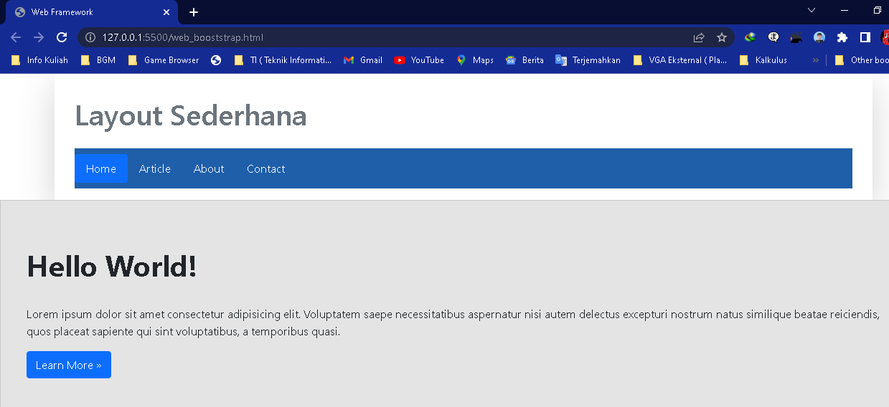
</p>

# 6.MEMBUAT (CARD 1,CARD 2, CARD 3) DAN WIDGET DENGAN GRID ROW DAN COL


Menambahkan CARD 1 dengan menggunakan grid row dan col dan juga menggunakan beberapa *class dalam bootstrap

Script kode card 1
```html
<!-- Row Content 1 -->
<div class="row">
    <!-- card 1 -->
    <div class="col-3">
        <div class="col mt-4">
            <div class="card" style="width: 18rem; border: 0;">
                
                <div class="card-body">
                    <h5 class="card-title">Heading</h5>
                    <p class="card-text">Lorem ipsum dolor sit, amet consectetur adipisicing elit. Voluptates,
                        facere.</p>
                    <a href="#" class="btn btn-primary">View detail</a>
                </div>
            </div>
        </div>
    </div>
```
Dan Ini adalah hasil output dari codingan tersebut

# CARD 1

Berikut merupakan card pertama

<p align="center">
	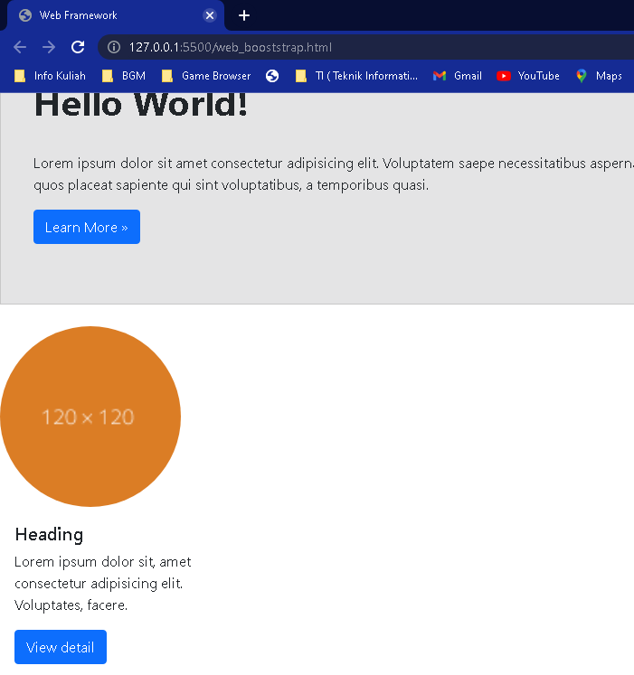

# CARD 2
Script kode card ke 2
```html
    <!-- card 2 -->
    <div class="col-3">
        <div class="col mt-4">
            <div class="card" style="width: 18rem; border: 0;">
                
                <div class="card-body">
                    <h5 class="card-title">Heading</h5>
                    <p class="card-text">Lorem ipsum dolor sit amet consectetur adipisicing elit. Distinctio,
                        magnam?</p>
                    <a href="#" class="btn btn-primary">View detail</a>
                </div>
            </div>
        </div>
    </div>
 ```         

Ouput :

<p align="center">
	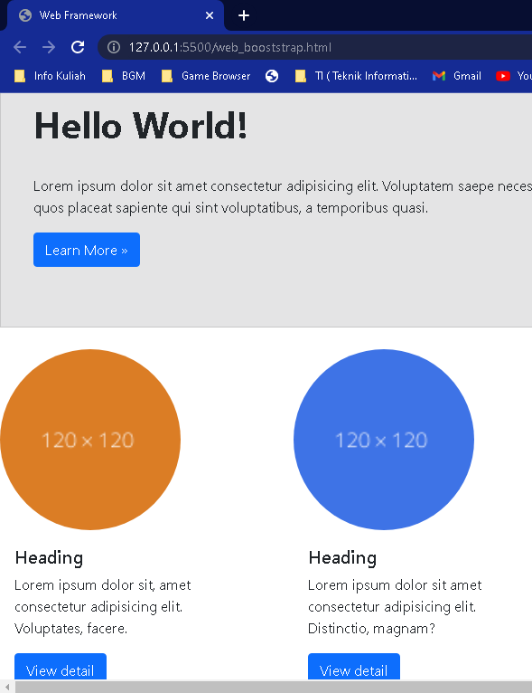

# CARD 3

Card 3 juga sama seperti card lain nya masih dalam row dan col yang class yang sama seperti contoh gambar di atas

Script kode card ke 3
```html
    <!-- card 3 -->
    <div class="col-3">
        <div class="col mt-4">
            <div class="card" style="width: 18rem; border: 0;">
                
                <div class="card-body">
                    <h5 class="card-title">Heading</h5>
                    <p class="card-text">Lorem ipsum dolor sit amet consectetur adipisicing elit. Nam, neque.
                    </p>
                    <a href="#" class="btn btn-primary">View detail</a>
                </div>
            </div>
        </div>
    </div>
```

Ouput card ke 3 :

<p align="center">
	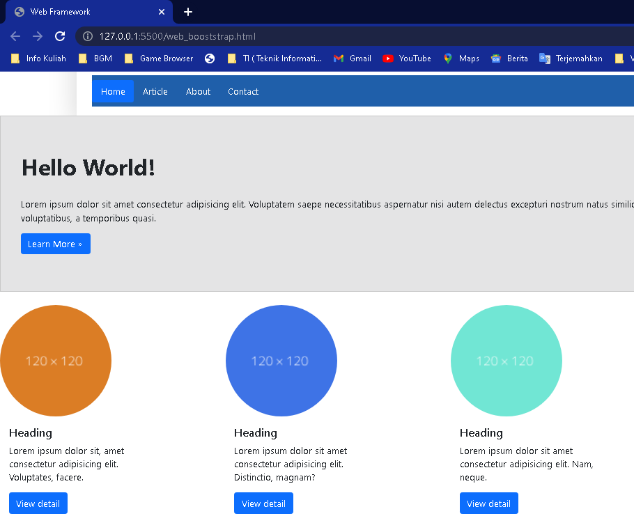

# WIDGET HEADER

Menambahkan Widget class list group pada bootstrap karena bootstrap sudah menyediakan nya tinggal masukan beberapa class pada elemen html untuk mendesainnya disini masih menggunakan col-3 begitu juga *widget berikut nya masih dibungkus dengan col-3 seperti contoh gambar di atas dan contoh code dibawah.

code html widget header
```html
    <!-- Widget Header -->
    <div class="col-3">
        <div class="list-group my-4" style="border-radius: 0;">
            <a href="#" class="list-group-item list-group-item-action active" aria-current="true"
                style="font-weight: bold;">
                Widget Header
            </a>
            <a href="#" class="list-group-item list-group-item-action">Widget Link</a>
            <a href="#" class="list-group-item list-group-item-action">Widget Link</a>
            <a href="#" class="list-group-item list-group-item-action">Widget Link</a>
            <a href="#" class="list-group-item list-group-item-action">Widget Link</a>
            <a href="#" class="list-group-item list-group-item-action">Widget Link</a>
        </div>
```                
Output :

<p align="center">
	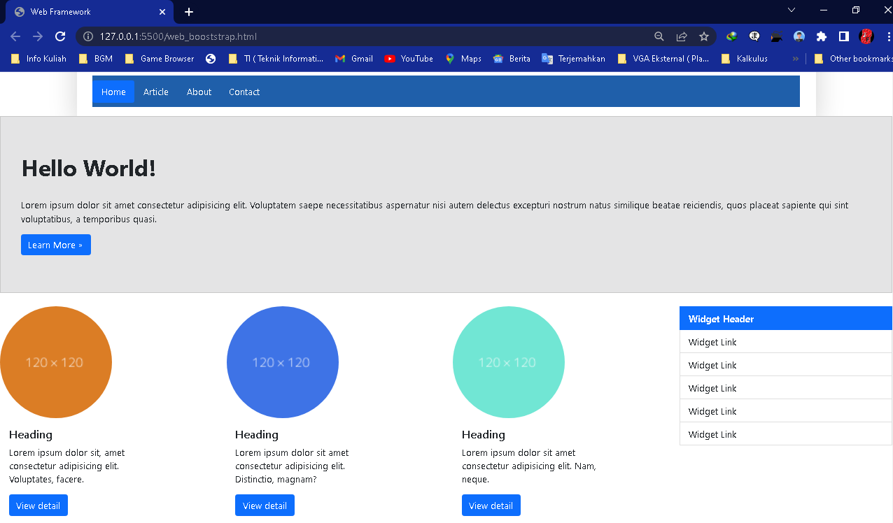

# WIDGET TEXT

Langkah berikutnya yaitu membuat widget text pada colom yang sama dengan widget header dan menggunakan beberapa class dibootstrap dalam membuat nya secara otomatis seperti contoh gambar di atas dan code dibawah.

Script kode widget text :
```html
        <!-- Widget Text -->
        <div class="list-group my-4" style="border-radius: 0; border: 1px #eee;">
            <a href="#" class="list-group-item list-group-item-action active " aria-current="true"
                style="font-weight: bold;">
                Widget Text
            </a>
            <a href="#" class="list-group-item list-group-item-action">
                <p>Lorem ipsum dolor sit amet consectetur adipisicing elit. Laboriosam quas natus, amet abvoluptatibus beatae accusamus, quam hic veritatis ipsa, accusantium est nihil dolores minus at labore sapiente autem vero.</p>
            </a>
        </div>
    </div>
``` 

Output :

<p align="center">
	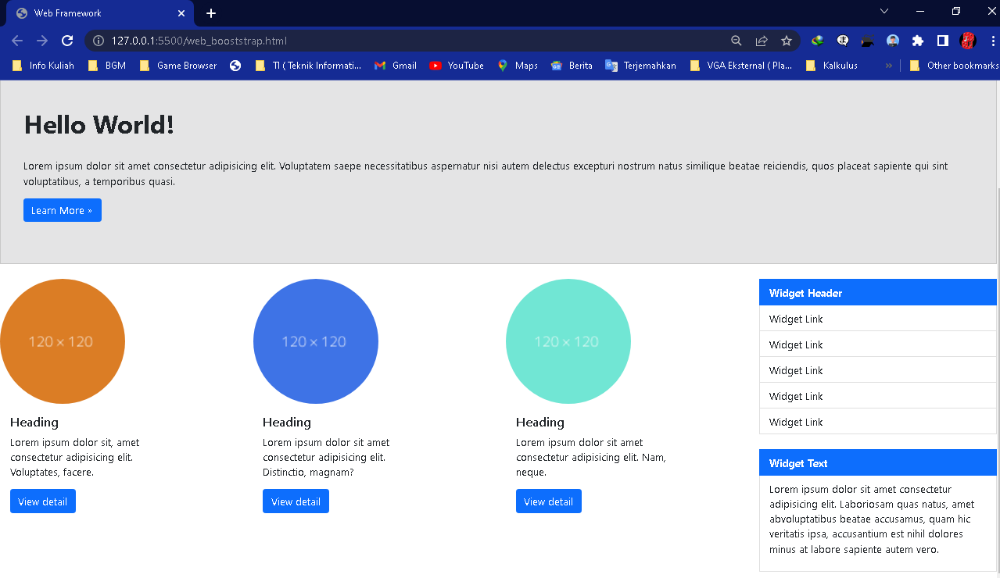

# MEMBUAT ROW CONTENT 2 (SECTION 1)

Lalu membuat row baru dan juga col baru dengan menambahkan class dan juga inline css untuk sedikit memperindah seperti gambar di atas dan code dibawah.

Script code content 2 section 1
```html
<!-- Row Content 2 -->
        <div class="row">
            <!-- Section 1 -->
            <div class="col-8-md">
                <div class="card mb-3" style="width: 900px; height: 200px;  border: 0;">
                    <div class="row g-0">
                        <div class="col-md-4">
                            
                        </div>
                        <div class="col-md-8">
                            <div class="card-body">
                                <h2 class="card-title" style="font-weight: bold;">First featurette heading</h2>
                                <p class="card-text" style="text-align: left;">This is a wider card with supporting text
                                    below as a
                                    natural lead-in to additional
                                    content. This content is a little bit longer. Lorem, ipsum dolor sit amet
                                    consectetur adipisicing
                                    elit. Velit animi quidem facere neque. Ea rem labore dolorum, necessitatibus quod,
                                    maiores tempore
                                    harum fugit qui accusantium iure. Dolorum illo repellat vitae?</p>
                                <p class="card-text"><small class="text-muted"></small></p>
                            </div>
                        </div>
                    </div>
                </div>
            </div>
        </div>
 ```    

Output :

<p align="center">
	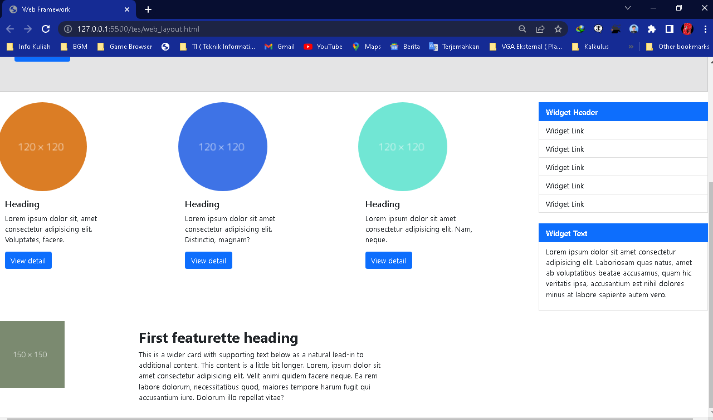

 # MEMBUAT ROW CONTENT 3 (SECTION 2)

Kemudian menambahkan section 2 dengan dibungkus row dan col seperti hasil di atas dan code html nya dibawah.

Script code content 3 section 2
```html
<!-- Row Content 3 -->
        <div class="row">
            <!-- Section 2 -->
            <div class="col-8-lg me-5">
                <div class="card mb-3" style="width: 900px; height: 200px; border: 0;">
                    <div class="row g-0">
                        <div class="col-md-8">
                            <div class="card-body">
                                <h2 class="card-title" style="font-weight: bold;">First featurette heading</h2>
                                <p class="card-text">This is a wider card with supporting text below as a natural
                                    lead-in to additional
                                    content. This content is a little bit longer. Lorem ipsum dolor sit amet consectetur
                                    adipisicing elit.
                                    Animi rerum at facilis nesciunt. Quidem, ullam quod beatae sapiente excepturi, vitae
                                    praesentium ipsa
                                    ab optio, doloribus voluptatem vel atque eveniet necessitatibus?</p>
                                <p class="card-text"><small class="text-muted"></small></p>
                            </div>
                        </div>
                        <div class="col-md-4">
                            
                        </div>
                    </div>
                </div>
            </div>
        </div>
```

Output :

<p align="center">
	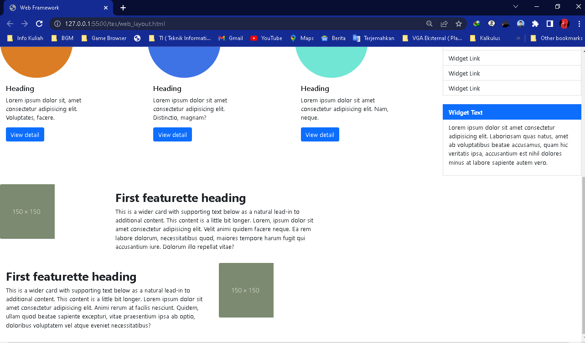

# MEMBUAT CARD FOOTER

Terakhir yaitu membuat card-footer dengan class card yang terdapat dibootstrap seperti gambar di atas dan code di bawah.

Script kode card-footer
```html
<div class="card-footer text-center" style=" background-color: #1d1d1d; color: #eee;">
    <p>© 2022 - Universitas Pelita Bangsa</p>
</div>
```

<p align="center">
	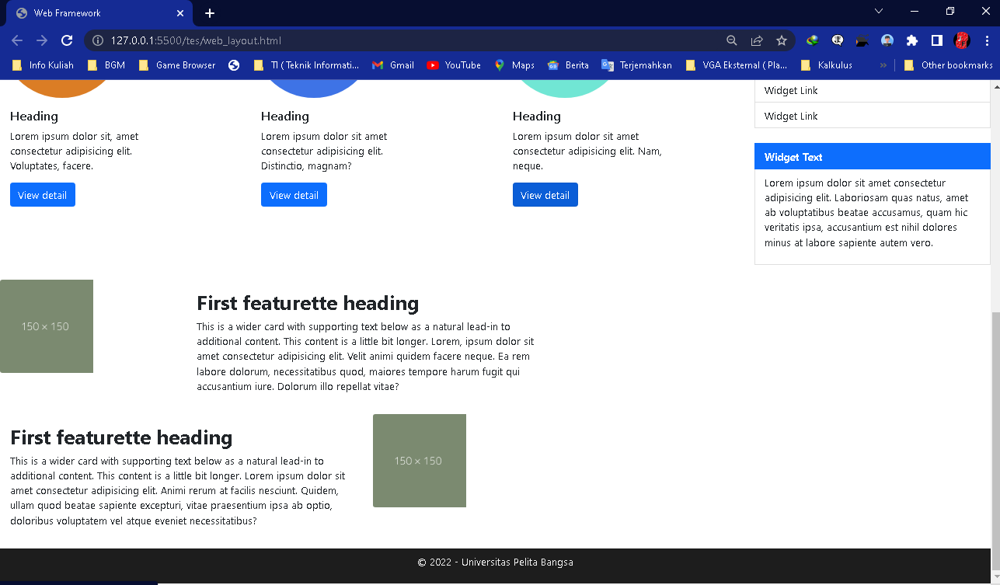
</p>

Full web layout dengan bootstraps

<p align="center">
	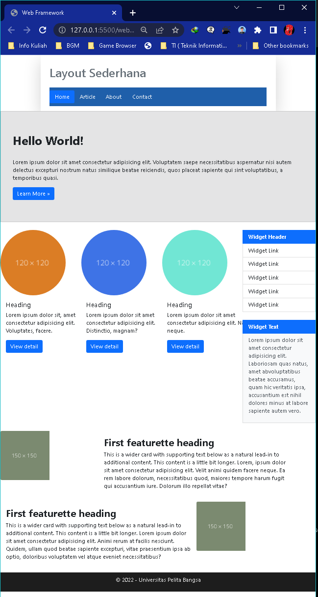
</p>